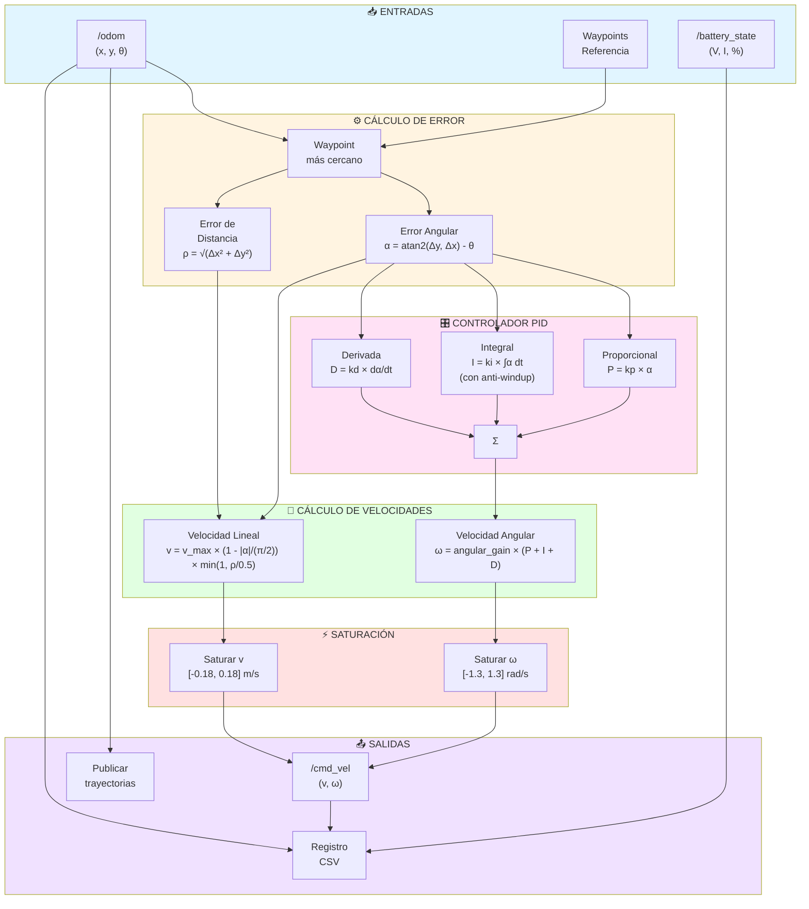
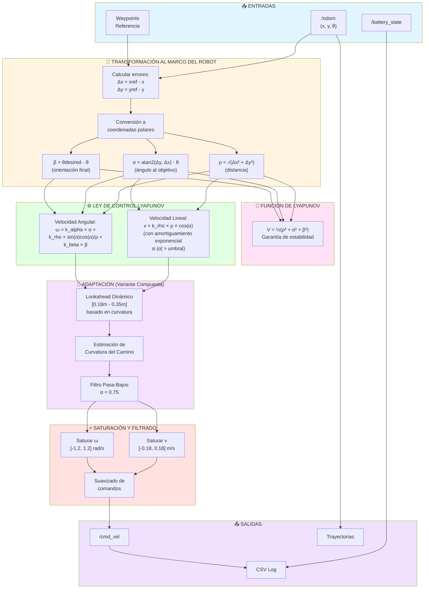
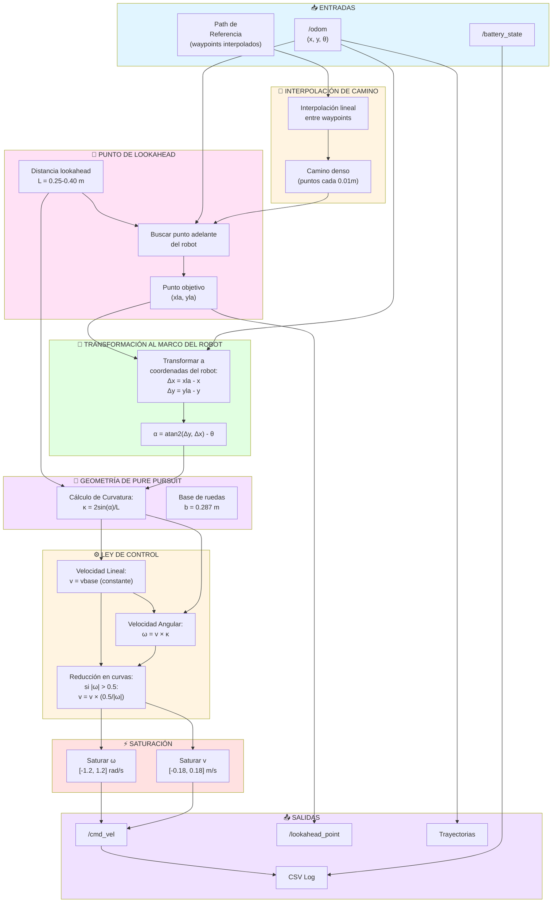
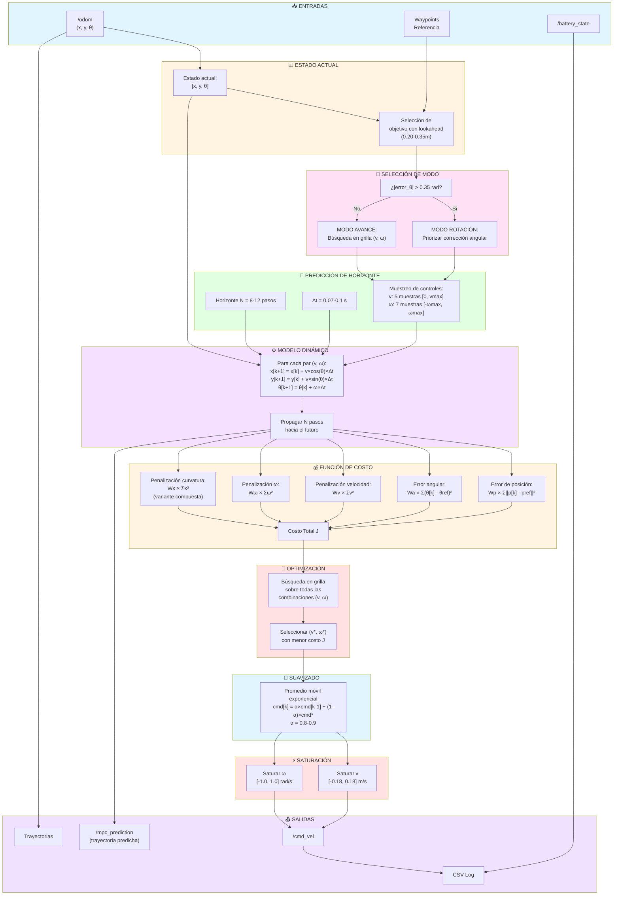
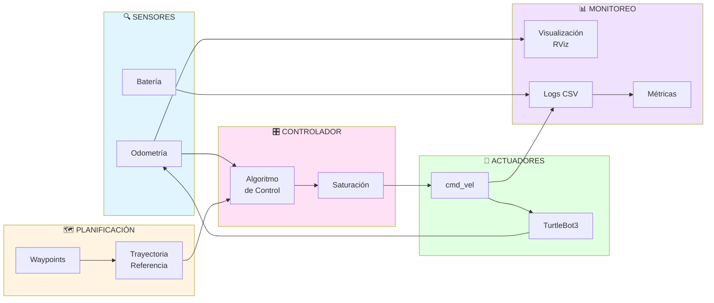

# Diagramas de Bloques de los Controladores

Este documento presenta los diagramas de bloques de los cuatro controladores principales implementados en el proyecto TurtleBot3.

## Índice
1. [Controlador PID](#1-controlador-pid)
2. [Controlador Lyapunov](#2-controlador-lyapunov)
3. [Controlador Pure Pursuit](#3-controlador-pure-pursuit)
4. [Controlador MPC (Model Predictive Control)](#4-controlador-mpc)

---

## 1. Controlador PID

### Diagrama de Bloques



### Ecuaciones de Control

**Error Angular:**
```
α = atan2(yref - y, xref - x) - θ
```

**Ley de Control PID:**
```
ω = angular_gain × (kp·α + ki·∫α dt + kd·dα/dt)
```

**Modulación de Velocidad Lineal:**
```
v = vmax × (1 - min(|α|/(π/2), 1)) × min(1, ρ/0.5)
```

**Parámetros típicos:**
- kp = 2.3 - 2.5
- ki = 0.25 - 0.3
- kd = 0.18 - 0.2
- angular_gain = 1.5
- vmax = 0.18 m/s
- ωmax = 1.0 - 1.3 rad/s
- Frecuencia: 100 Hz

---

## 2. Controlador Lyapunov

### Diagrama de Bloques



### Ecuaciones de Control

**Coordenadas Polares:**
```
ρ = √((xref - x)² + (yref - y)²)
α = atan2(yref - y, xref - x) - θ
β = θdesired - θ
```

**Función de Lyapunov:**
```
V = ½(ρ² + α² + β²)
```

**Leyes de Control:**
```
v = k_rho × ρ × cos(α) × e^(-|α|)   (si |α| > umbral)
v = k_rho × ρ × cos(α)              (en otro caso)

ω = k_alpha × α + k_rho × sin(α)cos(α)/ρ + k_beta × β
```

**Parámetros típicos:**
- k_rho = 0.3 - 0.45
- k_alpha = 1.5 - 1.9
- k_beta = -0.3
- vmax = 0.18 m/s
- ωmax = 1.0 - 1.2 rad/s
- Frecuencia: 50-80 Hz

---

## 3. Controlador Pure Pursuit

### Diagrama de Bloques



### Ecuaciones de Control

**Punto de Lookahead:**
```
Buscar punto en el camino a distancia L del robot
L = lookahead_distance (0.25-0.40 m)
```

**Ángulo al objetivo (en marco del robot):**
```
α = atan2(yla - y, xla - x) - θ
```

**Curvatura:**
```
κ = 2 × sin(α) / L
```

**Leyes de Control:**
```
v = vbase (velocidad constante)
ω = v × κ

Si |ω| > 0.5 rad/s:
    v = v × (0.5 / |ω|)  (reducción en curvas cerradas)
```

**Parámetros típicos:**
- L = 0.25 - 0.40 m (lookahead)
- vbase = 0.18 m/s
- ωmax = 1.0 - 1.2 rad/s
- wheelbase = 0.287 m (TurtleBot3 Waffle)
- Frecuencia: 20 Hz

---

## 4. Controlador MPC (Model Predictive Control)

### Diagrama de Bloques



### Ecuaciones de Control

**Modelo Dinámico:**
```
x[k+1] = x[k] + v[k] × cos(θ[k]) × Δt
y[k+1] = y[k] + v[k] × sin(θ[k]) × Δt
θ[k+1] = θ[k] + ω[k] × Δt
```

**Función de Costo:**
```
J = Σ(k=0 to N-1) [
    Wp × ||p[k] - pref[k]||² +
    Wa × (θ[k] - θref[k])² +
    Wv × v[k]² +
    Wω × ω[k]² +
    Wκ × κ[k]²
]
```

**Optimización:**
```
(v*, ω*) = argmin J(v, ω)
           v ∈ [0, vmax]
           ω ∈ [-ωmax, ωmax]
```

**Suavizado:**
```
vcmd = α × vcmd_prev + (1-α) × v*
ωcmd = α × ωcmd_prev + (1-α) × ω*
```

**Parámetros típicos:**
- N = 8-12 pasos (horizonte)
- Δt = 0.07-0.1 s
- Wp = 20-28 (peso posición)
- Wa = 1.0-1.3 (peso ángulo)
- Wv = 0.008-0.02
- Wω = 0.2-0.3
- Wκ = 0.15
- α = 0.8-0.9 (suavizado)
- vmax = 0.18 m/s
- ωmax = 1.0 rad/s
- Frecuencia: 10-14 Hz

---

## Comparación de Controladores

| Característica | PID | Lyapunov | Pure Pursuit | MPC |
|---------------|-----|----------|--------------|-----|
| **Tipo** | Clásico | Teórico | Geométrico | Predictivo |
| **Complejidad** | Baja | Media | Media | Alta |
| **Frecuencia** | 100 Hz | 50-80 Hz | 20 Hz | 10-14 Hz |
| **Estabilidad** | Empírica | Probada | Empírica | Garantizada (horizonte corto) |
| **Curvas** | Regular | Buena | Excelente | Excelente |
| **Costo computacional** | Muy bajo | Bajo | Bajo | Alto |
| **Parámetros** | 6 | 3-4 | 2-3 | 8-10 |
| **Lookahead** | No | Sí (adaptativo) | Sí (fijo) | Sí (adaptativo) |
| **Predicción** | No | No | No | Sí (N pasos) |

---

## Flujo General Común a Todos los Controladores



---

## Referencias

### Archivos de Implementación

**PID:**
- `turtlebot3_control/simple_pid_controller.py`
- `turtlebot3_control/simple_pid_controller_recta.py`
- `turtlebot3_control/simple_pid_controller_compuesta.py`

**Lyapunov:**
- `turtlebot3_control/simple_lyapunov_controller.py`
- `turtlebot3_control/simple_lyapunov_controller_recta.py`
- `turtlebot3_control/simple_lyapunov_controller_compuesta.py`

**Pure Pursuit:**
- `turtlebot3_control/pure_pursuit_controller_real.py`
- `turtlebot3_control/pure_pursuit_controller_real_recta.py`
- `turtlebot3_control/pure_pursuit_controller_real_compuesta.py`

**MPC:**
- `turtlebot3_control/mpc_controller_real.py`
- `turtlebot3_control/mpc_controller_real_recta.py`
- `turtlebot3_control/mpc_controller_real_compuesta.py`

### Referencias Teóricas

1. **PID Control:** Åström, K. J., & Hägglund, T. (2006). Advanced PID control.
2. **Lyapunov Control:** Siegwart, R., & Nourbakhsh, I. R. (2004). Introduction to autonomous mobile robots.
3. **Pure Pursuit:** Coulter, R. C. (1992). Implementation of the pure pursuit path tracking algorithm. Carnegie Mellon University.
4. **MPC:** Camacho, E. F., & Alba, C. B. (2013). Model predictive control.

---

**Última actualización:** 2025-12-01
